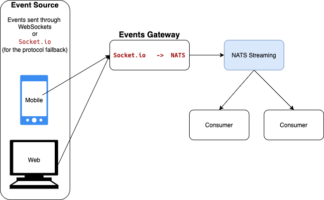

# Web Events POC

This proof of concept shows a Web chat using Socket.IO to send events to a Gateway, and thus posting it in a NATS Streaming server, from where it can be consumed by the interested consumers.

 

Resources: 

- [socket.io](https://socket.io/) : WebSocket connection if possible, and will fall back on HTTP long polling if not.
- [go-socket.io](https://github.com/googollee/go-socket.io) : Socket.io GO server
- [Nats Streaming Server](https://github.com/nats-io/nats-streaming-server) :  Lightweight reliable streaming platform built on NATS
